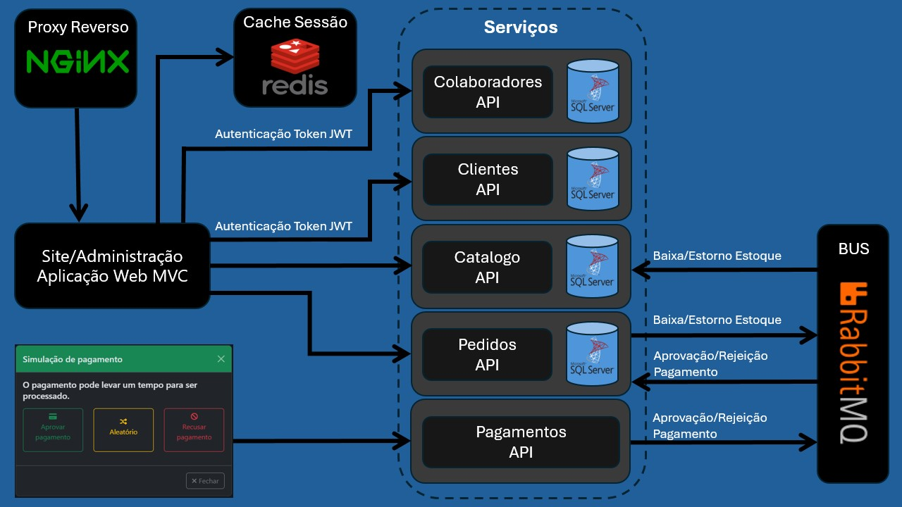
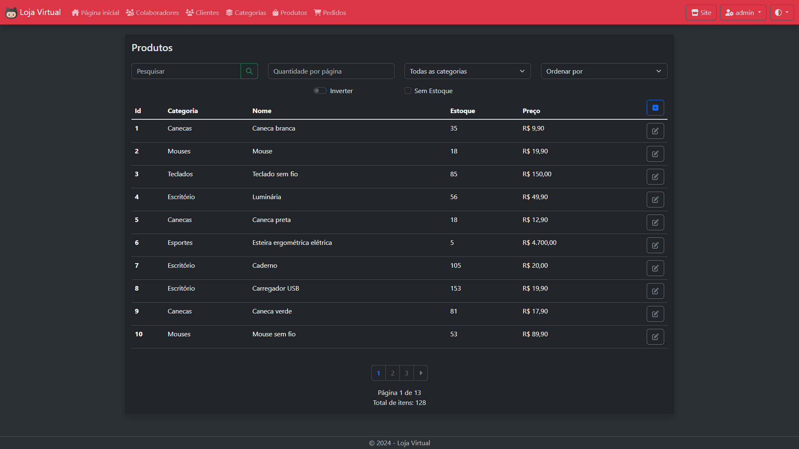

# Loja Virtual

Uma aplicação construída em .NET 8 com arquitetura baseada em serviços.
É um projeto pessoal para adquirir conhecimentos da complexidade de criar um sistema em microsserviços.



## Detalhes do site

A página inicial que é acessada pelos clientes.


No canto superior direito há um botão vermelho que leva até a área administrativa, o usuário padrão é **admin** com senha **admin**.



O site também é responsivo ao tamanho das telas e temas claro/escuro do dispositivo.


## Como executar

### Pré-requisitos
- [Docker](https://docs.docker.com/get-docker/)

### Instruções

- Baixe ou clone o repositório https://github.com/flaviobertoluchi/LojaVirtual
- Abra o terminal na raiz do projeto e execute o comando:
  ```
  docker-compose up -d
  ```
- Aguarde o processo de construção e início dos containers, então acesse no navegador: http://localhost
  > Nota: os serviços levam um tempo até iniciarem completamente, se ao acessar o link no navegador aparecer alguma mensagem de erro, aguarde mais um pouco e recarregue a página.

#### Kubernetes (Opcional)

Caso tenha interesse, navegando no projeto em **LojaVirtual > Tools > Minikube**, há instruções básicas para uma publicação simples no [Minikube](https://minikube.sigs.k8s.io/docs/start/).
