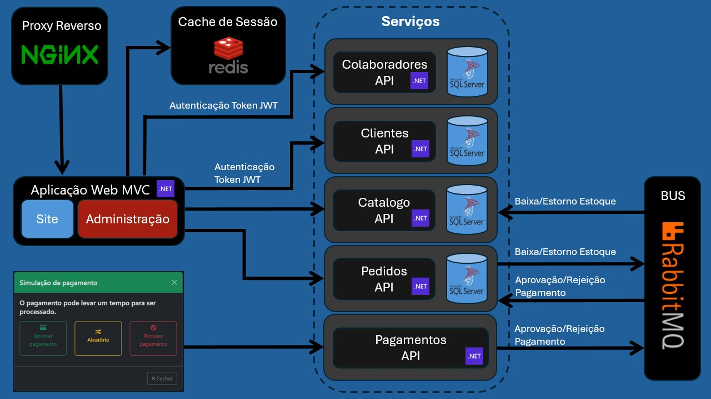
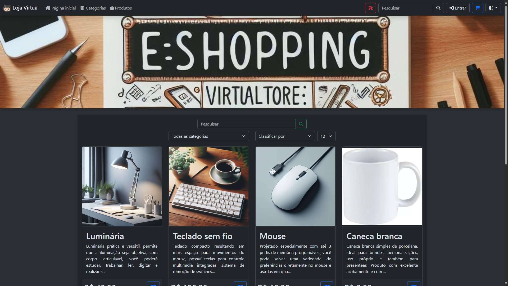
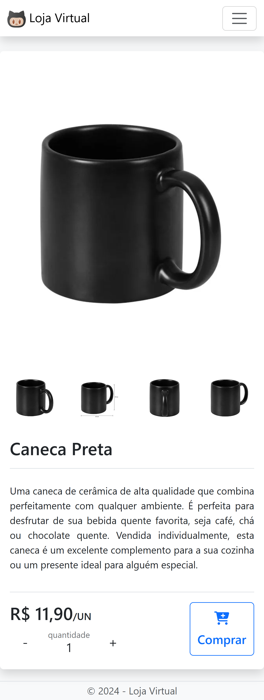

# Loja Virtual

Uma aplicação construída em .NET 8 com arquitetura baseada em microsserviços.
É um projeto pessoal para adquirir conhecimentos da complexidade de criar um sistema em microsserviços.



## Detalhes do site

A página inicial que é acessada pelos clientes.



No canto superior direito há um botão vermelho <span></span> que leva até a área administrativa, o usuário padrão é **admin** com senha **admin**.


O site também é responsivo ao tamanho da tela e ao tema (claro/escuro) do dispositivo.



## Como executar

### Pré-requisito

- [Docker](https://docs.docker.com/get-docker/)

### Instruções

#### Docker Hub

- Baixe: [docker-compose.yml](https://github.com/flaviobertoluchi/LojaVirtual/releases/latest/download/docker-compose.yml)
- No terminal execute o comando:
  ```
  docker-compose up -d
  ```

#### Compilação local

- Baixe ou clone o repositório https://github.com/flaviobertoluchi/LojaVirtual
- Abra o terminal na raiz do projeto e execute o comando:
  ```
  docker-compose up -d
  ```

### Acesso ao sistema

- Aguarde o processo de construção e início dos containers, então acesse no navegador: http://localhost
  > Nota: os serviços levam um tempo até iniciarem completamente, ao acessar o link no navegador se aparecer alguma mensagem de erro, aguarde mais um pouco e recarregue a página.

### Kubernetes (Opcional)

Caso tenha interesse, navegando no projeto em [Tools/Minikube](https://github.com/flaviobertoluchi/LojaVirtual/tree/master/Tools/Minikube), há instruções básicas para uma publicação simples no [Minikube](https://minikube.sigs.k8s.io/docs/start/).
